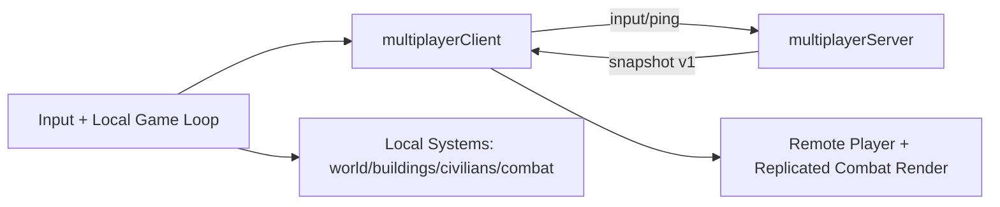
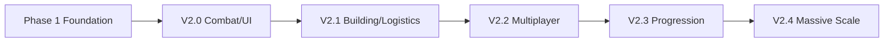

# Purrmadeath

Purrmadeath is a 2D survival/factory sandbox built with Pixi.js.
You gather resources, build defenses, spawn logistics civilians, and survive enemy waves.

Current multiplayer focus (v2.2.x) is replication infrastructure and session sync quality.

## Setup

```bash
npm install
```

## Run Modes

### Singleplayer (local)

```bash
npm start
```

- Opens the game locally at `http://localhost:3001`.

### Multiplayer (LAN host)

On the host machine:

```bash
npm run multiplayer:server
npm run start:lan
```

- Game host page runs on `http://<HOST_LAN_IP>:3001`.
- Multiplayer server runs on `ws://<HOST_LAN_IP>:8080`.

On another device in the same LAN:

- Open:
  - `http://<HOST_LAN_IP>:3001/?mp=1&mpHost=<HOST_LAN_IP>`

Example:

- `http://<HOST_LAN_IP>:3001/?mp=1&mpHost=<HOST_LAN_IP>`

### Useful scripts

```bash
npm start             # local singleplayer/dev
npm run start:lan     # serve game to LAN
npm run multiplayer:server
npm run build
```

## Quick Gameplay Controls

- `WASD` / Arrow keys: move
- `LMB` or `Space`: attack
- `1` / `2`: switch weapon
- `B`: toggle build mode
- `Tab` / Mouse Wheel: cycle build selection
- `E`: harvest/collect nearby
- `Delete` or `X`: remove selected building
- `ESC`: pause/resume
- `F4` or `\u00e7`: toggle dev console
- Dev sidebar sections: `C` perf, `V` cheats, `B` multiplayer, `N` logs, `G` core
- Dev slash commands: `/core`, `/perf`, `/multiplayer`, `/logs`, `/cheats`, `/all`
- Dev command textbox appears at the bottom of the sidebar (type `/` to start command input)
- Multiplayer connect toggle in dev sidebar: `P`

## Project Structure

```text
.
|- index.html
|- package.json
|- server/
|  |- multiplayerServer.js         # authoritative session server (WebSocket)
|- src/
|  |- index.js                     # runtime orchestration and main loop
|  |- config/
|  |  |- constants.js              # gameplay/perf/network tuning constants
|  |- net/
|  |  |- multiplayerClient.js      # browser network client + telemetry
|  |- systems/
|  |  |- worldSystem.js            # terrain, tiles, resources
|  |  |- playerSystem.js           # local player state/visuals
|  |  |- remotePlayerSystem.js     # replicated peer rendering/smoothing
|  |  |- enemySystem.js            # enemy AI and combat state
|  |  |- civilianSystem.js         # logistics workers
|  |  |- buildingSystem.js         # buildings, placement, production
|- ROADMAP.md
|- GUIDELINES.md
```

## Architecture Diagrams

### Runtime/Networking flow



### Roadmap progression (high level)



## Multiplayer Notes

- `0.0.0.0` is only a bind/listen address; clients should use the host LAN IP (for example `192.168.x.x`).
- Open firewall access for TCP `3001` and `8080` on the host.
- In-game dev console (`F4` or `\u00e7`) shows multiplayer status and LAN join hint.
- Dev console is a compact right terminal-style sidebar to avoid covering central gameplay view.
- Current 2.2.2 netcode improvements:
  - protocol versioned messages (`v1`)
  - player snapshot relevance culling
  - position quantization for lower bandwidth
  - authority-host replication for enemies/projectiles with relevance filtering
- Buildings/resources/civilian economy are still finalized in later shared-gameplay steps.
