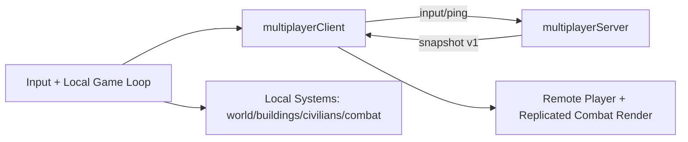
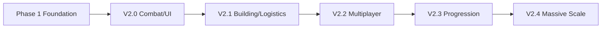

# Purrmadeath

Purrmadeath is a 2D survival/factory sandbox built with Pixi.js.
You gather resources, build defenses, and spawn logistics civilians.

Current multiplayer focus (v2.2.x) is replication infrastructure and session sync quality.

## Setup

```bash
npm install
```

## Run Modes

### Singleplayer (local)

```bash
npm start
```

- Opens the game locally at `http://localhost:3001`.

### Multiplayer (LAN host)

On the host machine:

```bash
npm run multiplayer:server
npm run start:lan
```

- Game host page runs on `http://<HOST_LAN_IP>:3001`.
- Multiplayer server runs on `ws://<HOST_LAN_IP>:8080`.

Security defaults for LAN server:
- Private-network clients only (`PRIVATE_NETWORK_ONLY=1`)
- Message payload limit and message-rate limits enabled
- Handshake timeout for unknown clients
- Optional join secret with `JOIN_TOKEN`
- Optional browser-origin allowlist with `ALLOWED_ORIGINS` (comma-separated)

Example hardened launch:

```bash
$env:JOIN_TOKEN="your_secret_join_code"
$env:ALLOWED_ORIGINS="http://192.168.4.31:3001,http://localhost:3001"
npm run multiplayer:server
```

Then clients join with:

- `http://<HOST_LAN_IP>:3001/?mp=1&mpHost=<HOST_LAN_IP>&joinToken=your_secret_join_code`

Important:
- Keep this server LAN-only unless you add TLS + proper auth.
- Do not port-forward `8080` directly to the internet.

On another device in the same LAN:

- Open:
  - `http://<HOST_LAN_IP>:3001/?mp=1&mpHost=<HOST_LAN_IP>`

Example:

- `http://<HOST_LAN_IP>:3001/?mp=1&mpHost=<HOST_LAN_IP>`

### Useful scripts

```bash
npm start             # local singleplayer/dev
npm run start:lan     # serve game to LAN
npm run multiplayer:server
npm run multiplayer:test:sync   # deterministic sync probe
npm run multiplayer:test:load   # bot load test (env: BOTS, DURATION_SEC)
npm run multiplayer:test:fault  # disconnect/reconnect fault probe
npm run build
```

## Quick Gameplay Controls

- `WASD` / Arrow keys: move
- `LMB` or `Space`: attack
- `1` / `2`: switch weapon
- `B`: toggle build mode
- `Tab` / Mouse Wheel: cycle build selection
- `E`: harvest/collect nearby
- `Delete` or `X`: remove selected building
- `ESC`: pause/resume (multiplayer: unanimous pause vote across connected players; solo can pause immediately, dedicated server authoritative)
- `F4` or `\u00e7`: toggle dev console
- Dev sidebar sections: `C` perf, `V` cheats, `M` multiplayer, `N` logs, `G` core
- Dev server metrics section: `Y` (shows server tick/sim/net load)
- Server metrics include pause-vote state (`pauseVotes / pauseEligiblePlayers`)
- Server metrics include restart-vote state (`restartVotes / restartEligiblePlayers`) and restart count
- Server metrics include combat correction counters (`killCorrections / goldCorrections`)
- Server attack diagnostics include target-validity rejects (`attackRejectedNoTarget`)
- Follower sword hits are now server-applied to replicated enemy HP; host receives visual replay flag to avoid double damage
- Follower pistol hits now follow the same server-applied damage + host visual-only replay path when flagged
- Enemy projectile hits are now server-applied to replicated player/civilian/building state (with consumed-projectile culling on authority path)
- Host-side local enemy-projectile damage application is disabled while connected to dedicated authority path (prevents double-apply)
- server now replicates AI directives (tower targets, ranged-enemy targets, civilian job hints) computed on dedicated tick
- authority host consumes replicated server AI directives for tower targeting, ranged-enemy targeting, and civilian producer/warehouse selection
- multiplayer non-player state now includes replicated `aiDirectives` in both full and delta snapshot modes
- server metrics now include AI-directive generation cost and assignment counts (tower/ranged/civilian)
- Dev slash commands: `/core`, `/perf`, `/multiplayer`, `/server`, `/logs`, `/cheats`, `/all`, `/force-reset`
- Dev terminal now keeps `FPS`/`Frame ms` in the header across views (`/server`, `/perf`, etc.)
- Dev command textbox appears in the sidebar (press `Tab` or type `/` to start command input)
- Multiplayer connect toggle in dev sidebar: `P`

## Project Structure

```text
.
|- index.html
|- package.json
|- server/
|  |- multiplayerServer.js         # authoritative session server (WebSocket)
|  |- actionUtils.js               # server action payload/resource validation helpers
|  |- netSecurity.js               # IP/origin/rate-limit security helpers
|  |- sanitizeState.js             # snapshot sanitization helpers
|  |- replicationPayload.js        # per-client non-player payload filtering/delta compression
|  |- tools/
|  |  |- syncProbe.js              # deterministic sync probe across multiple clients
|  |  |- loadTestBots.js           # configurable bot load test harness
|  |  |- faultProbe.js             # reconnect/fault tolerance probe
|- src/
|  |- index.js                     # thin bootstrap entrypoint
|  |- game/
|  |  |- bootstrap.js              # runtime orchestration and main loop
|  |  |- runtimeUtils.js           # shared runtime helpers (clock + spatial index)
|  |  |- persistenceController.js  # save/checkpoint persistence controller
|  |  |- crashLogger.js            # browser crash log capture/persist/export
|  |  |- simulationLoopController.js # fixed-step foreground/background simulation orchestrator
|  |- config/
|  |  |- constants.js              # gameplay/perf/network tuning constants
|  |- net/
|  |  |- multiplayerClient.js      # browser network client + telemetry
|  |  |- latencyHeuristics.js      # latency verdict helper (debug server panel)
|  |  |- replicationStateHash.js   # lightweight hash for replication change detection
|  |- multiplayer/
|  |  |- runtimePlayers.js         # shared runtime-player sync helpers
|  |- systems/
|  |  |- worldSystem.js            # terrain, tiles, resources
|  |  |- playerSystem.js           # local player state/visuals
|  |  |- remotePlayerSystem.js     # replicated peer rendering/smoothing
|  |  |- enemySystem.js            # enemy AI and combat state
|  |  |- enemyNavigation.js        # extracted path/spawn navigation helpers
|  |  |- enemyCollision.js         # extracted enemy collision helpers
|  |  |- civilianSystem.js         # logistics workers
|  |  |- civilianSpatialUtils.js   # civilian grid/perimeter/approach helpers
|  |  |- civilianCollision.js      # civilian crowd + player collision helpers
|  |  |- civilianReplication.js    # house timer label/replication helpers
|  |  |- civilianSync.js           # follower civilian snapshot sync helper
|  |  |- buildingSystem.js         # buildings, placement, production
|  |  |- buildingSystemUtils.js    # building placement/resource utility helpers
|  |- ui/
|  |  |- debugConsoleCommands.js   # debug slash-command parsing + view map
|  |  |- debugOverlaySections.js   # debug section line builders
|- ROADMAP.md
|- GUIDELINES.md
```

## Architecture Diagrams

### Runtime/Networking flow



### Roadmap progression (high level)



## Multiplayer Notes

- `0.0.0.0` is only a bind/listen address; clients should use the host LAN IP (for example `192.168.x.x`).
- Open firewall access for TCP `3001` and `8080` on the host.
- In-game dev console (`F4` or `Ç`) shows multiplayer status and LAN join hint.
- Dev console is a compact right terminal-style sidebar to avoid covering central gameplay view.
- LAN session currently supports up to 4 simultaneous players.
- Current 2.2.2 netcode improvements:
  - protocol versioned messages (`v1`)
  - player snapshot relevance culling
  - position quantization for lower bandwidth
  - authority-host replication for enemies/projectiles with relevance filtering
- Recent multiplayer highlights (2.2.x):
  - follower actions (attack/build/remove/harvest) relay to host authority
  - shared resources + building state sync from host to followers
  - enemies target all connected players
  - dead players cannot move and respawn after 15s
  - if all players are down at once, the run resets for the whole session
  - higher host entity snapshot cadence (~20 Hz) for smoother co-op combat
  - building state sync now sends only when changed (lower bandwidth + less follower stutter)
  - reconciliation smoothing reduces rubber-banding for small position drift
  - dev multiplayer metrics now include snapshot interval + jitter for LAN diagnostics
  - follower clients show immediate local action VFX for attack/build/remove requests
  - non-player snapshots use adaptive full-vs-delta compression per client
  - simulation now runs on fixed 60Hz steps for consistent gameplay across different render FPS
  - dev console has a dedicated server section to inspect host tick/sim/net load
  - server section now includes forwarded/rejected follower-action counters (early anti-flood telemetry)
  - server section includes a color-coded latency verdict hint (server-bound vs network-bound vs mixed)
  - follower harvest/resource-cheat actions relay to host authority and sync shared resources correctly
  - enemy ranged combat and damage processing include all connected players
  - civilians and house spawns are replicated to followers
  - multiplayer kill counter is attributed per player via replicated player state
  - player position sync stabilized with follower soft correction + host authoritative pose mirroring
  - top-right session time is host-authoritative and synced to followers
  - follower joins now trigger full building-state sync to avoid world divergence
  - house civilian timer labels are replicated to followers
  - follower movement delay reduced via client pose hints in input packets (server reconciliation)
  - follower correction tuned to reduce visible teleporting during desync recovery
  - follower client now tracks WebSocket backpressure and drops stale input/ping packets when send buffers spike
  - replicated enemies/projectiles now interpolate on followers to reduce snap jitter
  - 2.2.4-A migration started: session clock ownership moved to dedicated server tick (host browser no longer owns runtime clock)
  - shared multiplayer pause/restart flow (followers request, authority applies, state replicated)
  - pause now uses vote gating in co-op: all connected players must vote pause (single-player session pauses immediately)
  - restart now uses vote gating in co-op: all connected players must vote restart before session reset
  - pause menu now shows live restart-vote progress (`Restart vote: X/Y`) during multiplayer sessions
  - host force reset now applies to all connected players via server-owned restart version
  - co-op revive interaction (use `E` near downed teammate)
  - dynamic enemy scaling by active player count in session
  - authority checkpoints for multiplayer session restore (per session id)
  - local movement now uses normalized vectors to match server-side input clamping (better host/follower speed parity)
  - hidden host tabs keep multiplayer progression closer to real time via higher fixed-step catch-up budget
  - 2.2.5 started with trust-boundary hardening (server action validation + rate limiting)
  - follower build/remove now use request IDs with authority action-result acknowledgements
  - server now pre-validates follower build/remove requests (tile occupancy + resource sanity) before forwarding
  - follower build requests use temporary server-side cost reservations (with reject/timeout refund) to reduce overspend races
  - server now applies temporary tile reservation locks for follower build requests to avoid concurrent overlap races
  - duplicate/stale follower build/remove action IDs are rejected server-side (replay-safe action path)
  - build/remove requests now update server authoritative building replication state directly (faster follower consistency)
  - server panel now tracks building-state hash mismatches as an early desync indicator
  - producer output progression now ticks on the dedicated server authority path (cycle timers + stored output)
  - follower producer-output harvest collection is now server-resolved and updates shared resources authoritatively
  - shared resources now reconcile from authority snapshot baseline plus server-side adjustment deltas
  - follower attack actions now pass server guardrails (origin distance + per-weapon cooldown), with server metrics for forwarded/rejected attack actions
  - harvest/revive and build/remove actions now enforce server-side origin/range checks
  - server-side privileged action boundary blocks follower force-reset and dev-resource actions
  - auto quality governor now also reacts to server-load signals (`simMsAvg`, `loopLagMsAvg`) to protect co-op stability
  - server movement integration now uses elapsed wall-clock dt (clamped) to reduce slow follower movement when server tick jitter occurs
  - added dedicated multiplayer probes:
    - `npm run multiplayer:test:sync`
    - `npm run multiplayer:test:load`
    - `npm run multiplayer:test:fault`

## Security Notes

- Keep WebSocket server private to LAN unless you add TLS + authentication.
- Use `JOIN_TOKEN` on shared networks.
- Keep `PRIVATE_NETWORK_ONLY=1` enabled unless explicitly testing remote WAN access.
- Consider setting `ALLOWED_ORIGINS` to your known client URLs for stricter browser-origin filtering.
